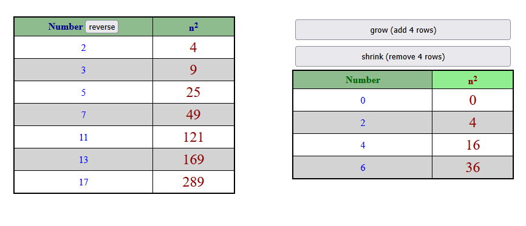
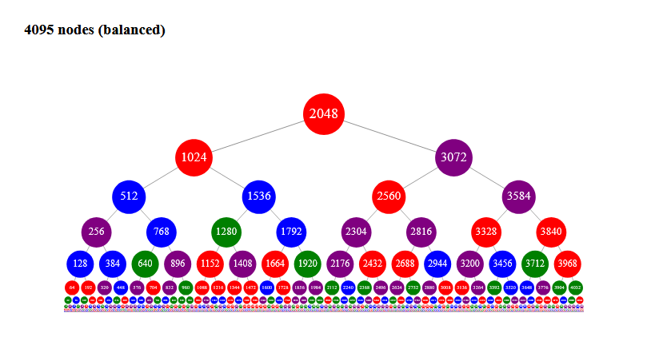
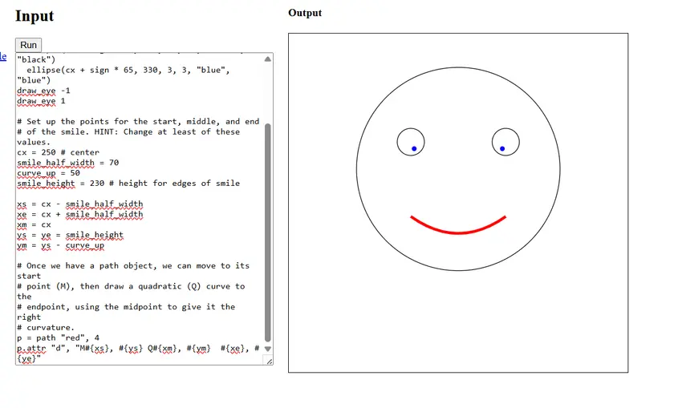

Welcome to my "blog"! For now this is just a big
markdown file that I host via Github Pages. I may
eventually move to a third-party blogging site or
build out some new features.

For now, feel free to give me feedback by
emailing me at `showell285@gmail.com` or by
joining [my Zulip realm](https://macandcheese.zulipchat.com/register).

(* see also [Steve resume](steve.html) *)

## Mentoring Apoorva

*February 20, 2026*

I have been mentoring a college student named
Apoorva Pendse (see [his GitHub repo](https://github.com/apoorvapendse))
since December 2025.  We got
connected somewhat indirectly through Zulip's
participation in the Google Summer of Code.

I'm a long-time contributor to the Zulip Open
Source project and a former employee of its
related company, Kandra Labs.  I met Apoorva
in early 2025 and mostly just interacted with
him on a social level, although back then I
did advise him on some small projects.

After a successful "Summer of Code", Apoorva
has continued to work on Zulip code despite
being back in "university life".

I had been mostly away from Zulip during
2025, but when I came back to catch up on news,
I started talking to Apoorva again, and we
got talking about some of the projects he was
working on.  Since some of them were in areas
of the code that I was familiar with, I started
unofficially mentoring him on a daily basis.

Fast forward to now.  We have been working quite
closely on a daily basis, including weekends, for
almost exactly two months now.

Apoorva lives in India, and I live in the US, so
all of our interaction is remote (and time shifted
by 10.5 hours!).  We naturally use the Zulip
tool itself as our primary means of collaboration
on improving Zulip.

We mostly talk on the "macandcheese" Zulip
instance that I administer.  This instance is
free to me through the generosity of the project,
and it is completely hosted on Zulip Cloud.

If you have read this far, I encourage you to join
[macandcheese](https://macandcheese.zulipchat.com/register).
As an aside, the whimsical name was actually coined
by another former GSoC student.

### Zulip collaboration style

When I work on Zulip projects (and projects in
general), I am fairly fanatical about creating
new dedicated **channels** on Zulip for even
seemingly small projects.  I have successfully
indoctrinated Apoorva into this philosophy, and
I think he would agree that it truly leverages
the power of Zulip. We not only have topics within
channels, but we segregate our conversations
according to which project we are working on
at the time. (There are always multiple projects
active; it's the nature of the beast.)

Just to illustrate how specific we can get in
our channels (emphasis on channels: not topics,
channels!), here are some recent examples:

* webex
* message store cleanup
* emoji picker
* gif picker project

In a typical work week, Apoorva and I exchange
roughly 1000 messages, so the discipline of
talking about project-specific topics within
project-specific channels pays huge dividends
over time.

### Apoorva has been productive!

Apoorva has been very productive during the two
months of our collaboration, and I will take
partial credit for his achievements.

Here are the commits that Tim (the project leader)
has **already merged to Zulip main** during our two months:

~~~
 2025-12-15 : tenor: Focus edit textarea on closing tenor picker with esc.
 2025-12-16 : eslint: Disable `import/unambiguous` rule for .md files.
 2025-12-19 : message_select: Fix text selection not working for clicks.
 2025-12-19 : tenor_picker: Use the filter-input styling for search input.
 2025-12-21 : search: Avoid showing topic suggestions from negated channels.
 2025-12-22 : search_suggestions: Show combined `#channel>topic` pills.
 2025-12-24 : message_header: Don't shift vdots on hiding icons.
 2025-12-25 : abstract_network_gif: Introduce an abstract base class.
 2025-12-25 : gifs: Introduce `abstract_gif_network.ts`.
 2025-12-25 : gifs: Unify GIPHY and Tenor UI.
 2025-12-25 : tenor: Introduce callback mechanism to render GIFs.
 2025-12-25 : tenor: Introduce the `TenorNetwork` class.
 2025-12-25 : tenor: Make `tenor.ts` members provider agnostic.
 2025-12-25 : tenor: Move `raw_tenor_result` parsing logic from `render_gifs_to_grid`.
 2025-12-25 : tenor: Move network stuff over to `tenor_network.ts`.
 2025-12-25 : tenor: Move the request payload construction from UI.
 2025-12-25 : tenor: Rename `.tenor-gif` and the tenor_gif template.
 2025-12-25 : tenor: Use `ask_tenor_for_gifs` to isolate network calls.
 2025-12-25 : tenor_network: Use a new network object per picker instance.
 2025-12-26 : gifs: Generate network objects based on realm state.
 2025-12-27 : gifs: Simplify `gif_picker_ui.hbs`.
 2025-12-31 : node_tests: Remove unused giphy.ts esm mock.
 2026-01-01 : user_presence: Remove dead `.user-name-and-status-wrapper`.
 2026-01-02 : buddy_list: Introduce background_task for non awaited code.
 2026-01-04 : activity_tests: Remove mock_template for presence rows.
 2026-01-06 : gifs: Introduce fallback placement options for GIFs.
 2026-01-07 : gifs: Rename `giphy_rating` to `gif_rating_policy`.
 2026-01-08 : quote_message: Improve sad-path UX when fetching raw_content.
 2026-01-09 : web: Use `apply_markdown` to get raw markdown.
 2026-01-12 : click: Prevent composebox refocus on double/triple clicks.
 2026-01-13 : gif_state: Use a better name for rating policy update handler.
 2026-01-13 : gifs: Rename `gif_rating_options` to `gif_rating_policy_options`.
 2026-01-14 : message_header: Avoid hiding icons on smaller widths.
 2026-01-14 : tenor_picker: Use `keyup` only when trying to focus GIFs.
 2026-01-15 : emoji_frequency: Ignore uncached messages on deletion events.
 2026-01-16 : emoji_frequency: Ignore reaction events from muted sources.
 2026-01-21 : emoji_frequency: Move data handling to emoji_frequency_data.ts
 2026-01-21 : emoji_frequency_data: Use better names for add/remove handlers.
 2026-01-22 : gifs: Focus compose box on closing picker with Escape.
 2026-01-22 : gifs: Prevent message navigation when navigating with arrows.
 2026-01-22 : gifs: Prevent stale network calls beacuse of debouncing.
 2026-01-27 : gif_picker: Switch to a two-column layout.
 2026-01-31 : click: Revert getSelection() check to determine link selection.
 2026-02-04 : docs: Add Spectacle for screenshot software on Linux.
 2026-02-07 : setup_docs: Use the `usermod` command for docker.
 2026-02-09 : message_quoting: Improve comment about using raw_content.
 2026-02-09 : quote_messages: Cache raw_content after fetching it.
 2026-02-10 : copy_messages: Improve end_id detection in analyze_selection.
 2026-02-10 : quote_message: Attempt to use `raw_content` in error callback.
 2026-02-11 : message_store: Conditionally update message's raw_content.
 2026-02-17 : search_pill: Dedupe types that can use PillRenderData.
 2026-02-17 : search_pill: Use hbs to render combined channel topic.
~~~

That's over 50 commits, and I would say that I have
participated in about 70% of those, and I even have
co-author status on some of them.

If you want to contribute to the Zulip project as a
developer, there is a high expectation of being a
generalist, and you can glean from the above commits
that Apoorva has worked in several areas of the codebase
recently.  Having said that, there have been some major
areas of concentration, so I will speak to a few of those.

### Tenor/Giphy unification

During our first few weeks, Apoorva had been tasked
with unifying code for two of Zulip's gif pickers
(Tenor and Giphy).  Zulip had long been using Giphy,
but it only started using Tenor during the summer of
2025.

During the initial prototyping of the Tenor project,
it was expedient to basically copy/paste a lot of
the Giphy code to reduce the risk of breaking Giphy
features while still working out bugs with the
Tenor prototype.

Once the Tenor prototype stabilized (as well as Tenor
itself being validated as a gif vendor),
it was clearly time to de-duplicate the new
code and move to more general-use components.

It was also time to clean up any technical debt
that had been accrued even before the Tenor project.

I think one of my assets as a senior developer
(I've been doing this for 40 years) is that I deeply
understand the best way to organize code for
re-use.

In some ways it's not actually rocket science.
Most of the tried-and-true principles of object
oriented development apply to the Zulip codebase,
and of course it helps to work with modern
JavaScript (er, actually TypeScript) in order
to facilitate good design.  (I believe some of
the giphy code was written before Zulip even
had the luxury of using es6 classes.)

Also, Apoorva already knew most of those principles
himself, so in many senses I was just validating
what he already knew, or, perhaps in some cases,
simply emphasizing the importance of them.

But there's also the logistics of incrementally
moving toward the final version, and that's an
area where my decade of working on the project
was probably most helpful.

We have pretty detailed conversations about
how to structure PRs to get from point A to
point B in the lease disruptive way possible.

#### Outcome

Zulip now has these generic files for picking
gifs:

```
 wc -l gif_picker_*
   23 gif_picker_popover_content.ts
  289 gif_picker_ui.ts
  312 total
```

And then there is a small amount of code that
is specific to each network:

```
 wc -l *network.ts
  39 abstract_gif_network.ts
 138 giphy_network.ts
 139 tenor_network.ts
 316 total
```

Here is `abstract_gif_network.ts` in its entirety:

``` ts
export type GifInfoUrl = {
    preview_url: string;
    insert_url: string;
};

export type RenderGifsCallback = (urls: GifInfoUrl[], next_page: boolean) => void;

export type GifProvider = "tenor" | "giphy";
// When a user clicks on the gif icon either while composing a
// message in the normal compose box or while editing a
// message, the UI will need to talk to a third party
// vendor such as tenor to get gifs.

// The network class will need to support this protocol.

// Typically, the UI will instantiate an object from a derived subclass
// of `GifNetwork`.
// Then they will make one or more calls to ask_for_*() to ask the
// third party to send back gif urls. See the callback
// type definition as well (RenderGifsCallback).

// The final piece of the contract is that if the user abandons the UI
// (typically the picker is a popover, but we don't care here), then
// the UI should call `abandon()` below. And then they should
// obviously never call the object again.
export abstract class GifNetwork {
    abstract get_provider(): GifProvider;
    abstract is_loading_more_gifs(): boolean;
    abstract ask_for_default_gifs(
        next_page: boolean,
        render_gifs_callback: RenderGifsCallback,
    ): void;
    abstract ask_for_search_gifs(
        search_term: string,
        next_page: boolean,
        render_gifs_callback: RenderGifsCallback,
    ): void;
    abstract abandon(): void;
}
```

## Cheating on math quiz problems (with Python)

*January 29, 2026*

In yesterday's blog I posed the following question,
and I showed how you could solve the problem using
pretty minimal calculation (*I only used the computer
for convenience, but there are pretty quick manual
ways to convert numbers back and forth between
base 4 and base 10 if you have pen and paper and
are reasonably adept at arithmetic.*)

**What is the smallest number
that is both a multiple of 241 (decimal) and the
sum of three powers of 4?**

I posed a very similar question to my programming
buddy Apoorva, but I forgot to tell him that
Python wasn't allowed! I asked him this:

**What is the smallest number
that is both a multiple of 16773121 (decimal) and the
sum of three powers of 4?**

And he came back pretty quickly with the
answer: 281474993487873

And when he showed me the answer, it was a
screenshot from a computer program!

He technically wasn't cheating, because I didn't
explain the rules, but, yeah, he was cheating.

So now I'm gonna cheat too!

Here's a program that correctly produces the
answer rather efficiently:

``` py
def enumerate_power_of_4_triplets(until_callback):
    i = 0
    j = 1
    k = 2

    # We compute higher powers of 4 lazily, and k will
    # always be the last index index into the list
    # (i.e. K + 1 == len(powers))
    powers = [1, 4, 16]

    while k < 100:
        assert k + 1 == len(powers)

        triplet_sum = powers[i] + powers[j] + powers[k]

        # for debugging
        # print(i, j, k, triplet_sum)

        if until_callback(triplet_sum):
            return triplet_sum

        # Our invariant is that i < j < k,
        # and we try to always bump the smallest
        # number we can.
        if i + 1 < j:
            i += 1
        elif j + 1 < k:
            j += 1
            i = 0
        else:
            powers.append(4 * powers[k])
            k += 1
            i = 0
            j = 1

answer = enumerate_power_of_4_triplets(
    until_callback=lambda n: n % 16773121 == 0
)
print(answer)
```

Here is my next question:

**Are there are any numbers for which none of
its infinite multiples can be expressed as a
sum of three distinct powers of 4? If so, what's the
smallest integer with that property?**

There may be some interesting number theory to
answer that question, but my intention is to
brute-force it with Python! (not till infinity,
of course, but up to some pretty big numbers)

Just to be clear, I have no idea what the answer
to my question is yet.

But as soon as I run my program, I think I have
some candidates:

~~~
5 does not seem to divide any triplets
17 does not seem to divide any triplets
31 does not seem to divide any triplets
41 does not seem to divide any triplets
~~~

Here is the loop that I used:

``` py
def seek_bad_numbers():
    bad_numbers = set()

    for i in range(2, 50):
        # Skip redundant answers. If 5 doesn't work, neither will
        # 10, 15, 20, etc.
        if any(i % bad_number == 0 for bad_number in bad_numbers):
            continue
        answer = enumerate_power_of_4_triplets(
            until_callback=lambda n: n % i == 0
        )
        if answer is None:
            bad_numbers.add(i)
            print(f"{i} does not seem to divide any triplets")
```

I didn't **prove** that 5 is an "impossible divisor", since
I capped my searches at a finite maximum power of 4. I used
`k < 200` as my upper bound. But I would be kinda surprised
if the smallest triplet that divided 5 included some massive
power of 4.

It's noteworthy that 5 and 17 are both trivially divisors
of **pairs** of powers-of-four.

~~~
5 == 1 + 4
17 == 1 + 16
~~~

I would have to search harder to find out if any multiple
of 31 can be expressed as the sum of a pair of powers.


## Self-masking numbers (a math problem)

*January 28, 2026*

Certain decimal numbers have the property that
they are self-masking.  Consider the number 9901.

Note that 99 + 01 = 100.

Also note the following addition:

~~~
 990100
 + 9901
 ======
1000001
~~~

You can think of the smaller number "masking"
away the "01" piece of "990100" with the "99".

So the relationship there is 9901 * 101 = 1000001,
which you can easily verify with a calculator.

You can apply the masking trick multiple times:

~~~
>>> 9901 * 1010101010101
10001010101010001
>>> 9901 * 101010101010101
1000101010101010001
>>> 9901 * 10101010101010101
100010101010101010001
~~~

If you were asked to find the smallest multiple
of 9901 that has exactly 2 one digits and the
rest zeros, then the first example I gave tells
you to multiply 9901 by 101, giving you the
result of 1000001. It's not trivial to prove
that there's no smaller number that can possibly
work here, but that's a bit out of scope for
the basic trick here.

Let's say you have a bigger decimal number
like 99990001 that is also self-masking.

Start by multiplying it by a number that induces
the masking one time:

~~~
>>> 99990001 * 10001
1000000000001
~~~

Or twice:

~~~
>>> 99990001 * 100010001
10000000100000001
~~~

Note that a number with exactly three 1 digits
and otherwise 0 digits is, by definition, the
sum of three distinct powers of 10.

So you could formulate the question as "Find the
smallest number that is the sum of three distinct
powers of ten that is also divisible by 99990001?"

And the answer would be 10000000100000001.

So once you know these tricks with ordinary decimal
numbers, how do you disguise the problem?

Well, here goes: **What is the smallest number
that is both a multiple of 241 (decimal) and the
sum of three powers of 4?**

The main trick there is to convert 241 to base 4
and notice that it is 3301 in base 4. (Back to decimal,
you have: 241 = 3 * 64 + 3 * 16 + 0 + 1).

3301 is self-masking in base 4 for the same reason
that 9901 is self-masking in decimal! Or that
FF01 is self-masking in hex!

And then to mask it, this is all in base 4:

     3301 * 10101 = 100010001 (base 4 arithmetic)

And then the powers of 4 here are 1, `4**4` (256),
and `4**8` (65536), so going back to decimal, the
answer is: **65793**

A quick sanity check in the Python shell is helpful
maybe:

~~~
>>> 65793 / 241
273.0
~~~

There are certainly other ways to solve this problem,
but I enjoy the self-masking angle from a programming
perspective.  It's like an extension of bit shifting
and bit masking.

## A Wacky Virtual Machine (2023)

*January 28, 2026*

In 2023 I took some time to educate myself on
Computational Theory, including watching some
of the excellent courseware from MIT that is
publicly available on YouTube.

See an example lecture
[here](https://www.youtube.com/watch?v=iZPzBHGDsWI).

Anyway, I wanted to get my hands dirty with
some simulations of virtual machines using Python.

The project is on my
[virtual-machine repo](https://github.com/showell/virtual-machine).

I created a simple virtual machine with the
following op-codes and a single register
called AX:

```
    00 (nada):
        (do nothing)

    01 (zero):
        AX = 3 -> ignore and continue
        AX = 2 -> ignore and continue
        AX = 1 -> ignore and continue
        AX = 0 -> halt and accept input

    10 (decr):
        AX = 3 -> AX = 2 and continue
        AX = 2 -> AX = 1 and continue
        AX = 1 -> AX = 0 and continue
        AX = 0 -> halt and reject input

    11 (mod2):
        AX = 3 -> AX = 1
        AX = 2 -> AX = 0
        AX = 1 -> AX = 1
        AX = 0 -> AX = 0
```

I constrained every program to have exactly six
instructions.

My input alphabet consists of the numbers 0, 1, 2, and 3.

There are 16 different languages that could possibly
be accepted--it's just all the subsets of `[0, 1, 2, 3]`,
including the empty set and the set itself.

My virtual machine was robust enough (or big enough,
if you will) that you could write a program for
every possible language that you wanted to accept.

Here is the output from running `python virtual_machine.py`.

~~~
[] is solved by 844 possible program
See an example program below.
   it accepts []
   it rejects [0, 1, 2, 3]
--
nada # do nothing
nada # do nothing
nada # do nothing
nada # do nothing
nada # do nothing
nada # do nothing
--

[0] is solved by 681 possible program
See an example program below.
   it accepts [0]
   it rejects [1, 2, 3]
--
zero # accept original input if AX = 0
nada # do nothing
nada # do nothing
nada # do nothing
nada # do nothing
nada # do nothing
--

[1] is solved by 303 possible program
See an example program below.
   it accepts [1]
   it rejects [0, 2, 3]
--
decr # reject zero or decrement AX
zero # accept original input if AX = 0
nada # do nothing
nada # do nothing
nada # do nothing
nada # do nothing
--

[0, 1] is solved by 172 possible program
See an example program below.
   it accepts [0, 1]
   it rejects [2, 3]
--
zero # accept original input if AX = 0
decr # reject zero or decrement AX
zero # accept original input if AX = 0
nada # do nothing
nada # do nothing
nada # do nothing
--

[2] is solved by 248 possible program
See an example program below.
   it accepts [2]
   it rejects [0, 1, 3]
--
decr # reject zero or decrement AX
decr # reject zero or decrement AX
zero # accept original input if AX = 0
nada # do nothing
nada # do nothing
nada # do nothing
--

[0, 2] is solved by 883 possible program
See an example program below.
   it accepts [0, 2]
   it rejects [1, 3]
--
mod2 # subtract 2 from AX if AX >= 2
zero # accept original input if AX = 0
nada # do nothing
nada # do nothing
nada # do nothing
nada # do nothing
--

[1, 2] is solved by 74 possible program
See an example program below.
   it accepts [1, 2]
   it rejects [0, 3]
--
decr # reject zero or decrement AX
zero # accept original input if AX = 0
decr # reject zero or decrement AX
zero # accept original input if AX = 0
nada # do nothing
nada # do nothing
--

[0, 1, 2] is solved by 13 possible program
See an example program below.
   it accepts [0, 1, 2]
   it rejects [3]
--
zero # accept original input if AX = 0
decr # reject zero or decrement AX
zero # accept original input if AX = 0
decr # reject zero or decrement AX
zero # accept original input if AX = 0
nada # do nothing
--

[3] is solved by 63 possible program
See an example program below.
   it accepts [3]
   it rejects [0, 1, 2]
--
decr # reject zero or decrement AX
decr # reject zero or decrement AX
decr # reject zero or decrement AX
zero # accept original input if AX = 0
nada # do nothing
nada # do nothing
--

[0, 3] is solved by 12 possible program
See an example program below.
   it accepts [0, 3]
   it rejects [1, 2]
--
zero # accept original input if AX = 0
decr # reject zero or decrement AX
decr # reject zero or decrement AX
decr # reject zero or decrement AX
zero # accept original input if AX = 0
nada # do nothing
--

[1, 3] is solved by 520 possible program
See an example program below.
   it accepts [1, 3]
   it rejects [0, 2]
--
mod2 # subtract 2 from AX if AX >= 2
decr # reject zero or decrement AX
zero # accept original input if AX = 0
nada # do nothing
nada # do nothing
nada # do nothing
--

[0, 1, 3] is solved by 150 possible program
See an example program below.
   it accepts [0, 1, 3]
   it rejects [2]
--
zero # accept original input if AX = 0
mod2 # subtract 2 from AX if AX >= 2
decr # reject zero or decrement AX
zero # accept original input if AX = 0
nada # do nothing
nada # do nothing
--

[2, 3] is solved by 13 possible program
See an example program below.
   it accepts [2, 3]
   it rejects [0, 1]
--
decr # reject zero or decrement AX
decr # reject zero or decrement AX
zero # accept original input if AX = 0
decr # reject zero or decrement AX
zero # accept original input if AX = 0
nada # do nothing
--

[0, 2, 3] is solved by 1 possible program
See an example program below.
   it accepts [0, 2, 3]
   it rejects [1]
--
zero # accept original input if AX = 0
decr # reject zero or decrement AX
decr # reject zero or decrement AX
zero # accept original input if AX = 0
decr # reject zero or decrement AX
zero # accept original input if AX = 0
--

[1, 2, 3] is solved by 15 possible program
See an example program below.
   it accepts [1, 2, 3]
   it rejects [0]
--
decr # reject zero or decrement AX
mod2 # subtract 2 from AX if AX >= 2
zero # accept original input if AX = 0
decr # reject zero or decrement AX
zero # accept original input if AX = 0
nada # do nothing
--

[0, 1, 2, 3] is solved by 104 possible program
See an example program below.
   it accepts [0, 1, 2, 3]
   it rejects []
--
mod2 # subtract 2 from AX if AX >= 2
zero # accept original input if AX = 0
decr # reject zero or decrement AX
zero # accept original input if AX = 0
nada # do nothing
nada # do nothing
--
~~~

Just to be clear about the finite nature of this
exercise on any every level (hence no halting problem),
there are exactly 4**6 (4096) possible programs
that you could write for my machine.

And the way that I produced the output above is
that I ran all 4096 possible programs.

To simulate any particular program, I used the
following simple Python code:

``` py
def run_progam(n, program):
    halted = False
    AX = n
    status = None

    assert len(program) == MAX_STEPS

    for op in program:
        if halted:
            continue
        if op == "nada":
            pass
        elif op == "zero":
            if AX == 0:
                halted = True
                status = True
            else:
                pass
        elif op == "decr":
            if AX == 0:
                halted = True
                status = False
            else:
                AX -= 1
        elif op == "mod2":
            AX = AX % 2
        else:
            assert False

    return status
```

In order to work fully in integer space at the
computational level but to read the program as
a human, I had little helper methods like so:

``` py
def assemble(program):
    return sum(OPS[op] * (4**i) for i, op in enumerate(program))


def disassemble(n):
    ops = ["nada", "zero", "decr", "mod2"]
    program = []
    for i in range(MAX_STEPS):
        program.append(ops[n % 4])
        n = n // 4
    return program


def encoded_language(lang):
    return sum(2**n for n in lang)


def language(code):
    lang = []
    i = 0
    while code:
        if code % 2 == 1:
            lang.append(i)
        code = code // 2
        i += 1
    return lang
```

And here was the basic code to compute example
programs for each possible "language":

``` py
def find_solutions():
    solutions = {}

    for y in range(16):
        solutions[y] = []

    for program_number in range(4**MAX_STEPS):
        program = disassemble(program_number)
        lang = get_language_that_program_accepts(program)
        solutions[encoded_language(lang)].append(program_number)

    for y in range(16):
        assert len(solutions[y]) > 0

    for y in range(16):
        lang = language(y)
        rejected_lang = complement(lang)
        x_list = solutions[y]
        programs = [disassemble(x) for x in x_list]
        print(f"{lang} is solved by {len(x_list)} possible program")
        print(f"See an example program below.")
        print(f"   it accepts {lang}")
        print(f"   it rejects {rejected_lang}")
        print("--")
        example_program = programs[0]
        for cmd in example_program:
            print(cmd, COMMENT[cmd])
        print("--")
        print()
```

All of that exercise was kinda fun, but it's
pretty standard stuff even before you get into
any deep kind of computational theory. (Way back
in ~1988 I had to simulate some subset of the 8086
assembly language in Pascal, if memory serves.)

But there were some bizarre tacks that I took.

As part of my self-education, I learned a bit
about the **Cook Levin Theorem**, in which it
is proven that the Boolean Satisfiability
Problem (SAT) is NP-complete.

The basic sketch of the proof is that they
encode the computation of a Turing machine into
a Boolean formula. I'll be a bit hand-wavy about
how that gets you to the actual proof, but that's
not really necessary.

I decided that I wanted to make **my** virtual
machine work off of Boolean polynomials.

I didn't get as far as computing Boolean polynomials
for the entire six-line program structure, but
I did do it for the single step of evaluating an
opcode.

Here is the relevant code from `stepper.py`:

``` py
from poly import Poly


def VAR(label):
    return Poly.var(label)


def NOT(x):
    return 1 - x


def AND(x, y):
    return x * y


def OR(x, y):
    return (x + y) - (x * y)


def OR4(w, x, y, z):
    return OR(OR(w, x), OR(y, z))


FALSE = Poly.constant(0)


def construct_polynomials(*, hb, lb, halted, accepted, op_hb, op_lb):
    is_3 = AND(hb, lb)
    is_2 = AND(hb, NOT(lb))
    is_1 = AND(NOT(hb), lb)
    is_0 = AND(NOT(hb), NOT(lb))

    is_pass = AND(NOT(op_hb), NOT(op_lb))
    is_check = AND(NOT(op_hb), op_lb)
    is_decr = AND(op_hb, NOT(op_lb))
    is_mod2 = AND(op_hb, op_lb)

    runs_pass = OR(is_pass, halted)
    runs_check = AND(is_check, NOT(halted))
    runs_decr = AND(is_decr, NOT(halted))
    runs_mod2 = AND(is_mod2, NOT(halted))

    pass1 = AND(is_1, runs_pass)
    pass2 = AND(is_2, runs_pass)
    pass3 = AND(is_3, runs_pass)
    pass_accepts = FALSE
    pass_halts = FALSE

    check1 = AND(is_1, runs_check)
    check2 = AND(is_2, runs_check)
    check3 = AND(is_3, runs_check)
    check_accepts = AND(is_0, runs_check)
    check_halts = FALSE

    decr1 = AND(is_2, runs_decr)
    decr2 = AND(is_3, runs_decr)
    decr3 = FALSE
    decr_accepts = FALSE
    decr_halts = AND(is_0, runs_decr)

    mod1 = AND(OR(is_3, is_1), runs_mod2)
    mod2 = FALSE
    mod3 = FALSE
    mod_accepts = FALSE
    mod_halts = FALSE

    newly_accepted = OR4(pass_accepts, check_accepts, decr_accepts, mod_accepts)
    accepted = OR(accepted, newly_accepted)

    newly_halted = OR4(pass_halts, check_halts, decr_halts, mod_halts)
    halted = OR(halted, newly_halted)

    becomes_1 = OR4(pass1, check1, decr1, mod1)
    becomes_2 = OR4(pass2, check2, decr2, mod2)
    becomes_3 = OR4(pass3, check3, decr3, mod3)

    hb_set = OR(becomes_3, becomes_2)
    lb_set = OR(becomes_3, becomes_1)

    return (hb_set, lb_set, halted, accepted)


STEP_POLYNOMIALS = construct_polynomials(
    hb=VAR("hb"),
    lb=VAR("lb"),
    halted=VAR("halted"),
    accepted=VAR("accepted"),
    op_hb=VAR("op_hb"),
    op_lb=VAR("op_lb"),
)
```

Now for the wacky result.  Here is the `accepted`
polynomial:

```
(-1)*accepted*halted*hb*lb*op_hb*op_lb+accepted*halted*hb*lb*op_lb+accepted*halted*hb*op_hb*op_lb+(-1)*accepted*halted*hb*op_lb+accepted*halted*lb*op_hb*op_lb+(-1)*accepted*halted*lb*op_lb+(-1)*accepted*halted*op_hb*op_lb+accepted*halted*op_lb+accepted*hb*lb*op_hb*op_lb+(-1)*accepted*hb*lb*op_lb+(-1)*accepted*hb*op_hb*op_lb+accepted*hb*op_lb+(-1)*accepted*lb*op_hb*op_lb+accepted*lb*op_lb+accepted*op_hb*op_lb+(-1)*accepted*op_lb+accepted+halted*hb*lb*op_hb*op_lb+(-1)*halted*hb*lb*op_lb+(-1)*halted*hb*op_hb*op_lb+halted*hb*op_lb+(-1)*halted*lb*op_hb*op_lb+halted*lb*op_lb+halted*op_hb*op_lb+(-1)*halted*op_lb+(-1)*hb*lb*op_hb*op_lb+hb*lb*op_lb+hb*op_hb*op_lb+(-1)*hb*op_lb+lb*op_hb*op_lb+(-1)*lb*op_lb+(-1)*op_hb*op_lb+op_lb
```

And I actually evaluated that polynomial as part of
my simulation.  As well as three other polynomials.
And it got the exact same results as the mundane
virtual machine!

## Pure HTML/JS, no-frills programming (2023)

*January 28, 2026*

Every now and then it's fun to build a simple
but not totally trivial app (multiple modules)
without any kind of build process.

The code from my [table_widget repo](https://github.com/showell/table_widget) avoids so many moving parts:
* no webpack
* no compilers or transpilers
* no jQuery or third party libraries
* no frameworks
* no templates
* no external CSS files

Don't get me wrong, it's a pretty small and
unimpressive project.  I just wanted to build
some table widgets that look like this:



You can see the whole program in action
[here](https://showell.github.io/table_widget/).

The project has exactly one HTML file called
`index.html`:

``` html
<!DOCTYPE html>
<head>
    <title>Table Widget</title>
    <style>
        body {
            padding-top: 50px;
        }

        #app {
            display: flex;
            justify-content: space-evenly;
        }

        #even_numbers {
            display: flex;
            flex-direction: column;
    </style>

</head>
<body>
    <div id="app">
        <div id="fruits"></div>
        <div id="persons"></div>
        <div id="prime_squares"></div>
        <div id="even_numbers"></div>
    </div>
</body>
<script src="./data_helpers.js"></script>
<script src="./style_helpers.js"></script>
<script src="./dom_helpers.js"></script>
<script src="./table_helpers.js"></script>
<script src="./integer_table_helper.js"></script>
<script src="./single_column_table_helper.js"></script>
<script src="./table.js"></script>
```

And then all the JS files use the same structure to
"export" their namespaces right on to the `window`
object.

Here is `table_helpers.js`:

``` js
window.table_helpers = (function () {
    const { dom_empty_table } = window.dom_helpers;

    const { setStyles } = window.style_helpers;
    console.log("YO", setStyles);

    function list_renderer({ parent_elem, make_child, get_num_rows }) {
        function overwrite(i, elem) {
            console.log("overwrite", i);
            if (i >= parent_elem.children.length) {
                parent_elem.append(elem);
            } else {
                parent_elem.replaceChild(elem, parent_elem.children[i]);
            }
        }

        function is_child_too_far_down(i) {
            // TODO: integrate once I guarantee tables get wrapped in a scroll
            // container early enough.
            const scroll_container = parent_elem.closest(
                ".table_scroll_container"
            );
            const child_top =
                parent_elem.children[i].getBoundingClientRect().top;
            const container_bottom =
                scroll_container.getBoundingClientRect().bottom;
            console.log(Math.floor(child_top), Math.floor(container_bottom));

            return child_top > container_bottom;
        }

        function repopulate_range(lo, hi) {
            for (let i = lo; i < hi; ++i) {
                overwrite(i, make_child(i));
            }
        }

        function compress(num_rows) {
            for (let i = parent_elem.children.length - 1; i >= num_rows; --i) {
                parent_elem.children[i].remove();
            }
        }

        function repopulate() {
            const num_rows = get_num_rows();
            compress(num_rows);
            repopulate_range(0, num_rows);
        }

        function resize_list() {
            /*
                The contract here is that none of the existing data elements
                have changed.
            */
            const num_rows = get_num_rows();
            compress(num_rows);
            repopulate_range(parent_elem.children.length, num_rows);
        }

        return { resize_list, repopulate };
    }

    function wrap_table(table, maxHeight) {
        const div = document.createElement("div");

        div.className = "table_scroll_container";

        setStyles(div, {
            display: "inline-block",
            overflowY: "scroll",
            maxHeight,
        });

        div.append(table);
        return div;
    }

    function simple_table_widget({
        make_header_row,
        make_tr,
        get_num_rows,
        maxHeight,
    }) {
        function resize_list() {
            console.log("resize_list", table.id);
            my_renderer.resize_list();
        }

        function repopulate() {
            console.log("repopulate", table.id);
            my_renderer.repopulate();
        }

        const { table, thead, tbody } = dom_empty_table();

        thead.append(make_header_row());

        // It is important to wrap the table with a scrolling container
        // BEFORE you start rendering the list of rows.

        const scroll_container = wrap_table(table, maxHeight);

        const my_renderer = list_renderer({
            parent_elem: tbody,
            make_child: make_tr,
            get_num_rows,
        });

        repopulate();

        return { scroll_container, table, repopulate, resize_list };
    }

    function wire_up_reverse_button({ th, callback }) {
        const button = document.createElement("button");
        button.innerText = "reverse";
        button.addEventListener("click", callback);
        th.append("  ", button);
    }

    return {
        simple_table_widget,
        wire_up_reverse_button,
    };
})();
```

The outer structure is like so:

``` js
window.table_helpers = (function () {

    // ...

    return {
        simple_table_widget,
        wire_up_reverse_button,
    };
})();
```

That exports the functions `simple_table_widget`
and `wire_up_reverse_button` on to `windows.table_helpers`.

And then that same code emulates imports like so:

``` js
    const { dom_empty_table } = window.dom_helpers;
    const { setStyles } = window.style_helpers;
```

For a small project like this, it's pretty easy to manage
naming collisions. Just use the same names for your
`window.foo` "exports" as the file names itself. And don't
use any names that are obviously on `window` itself.

There's a variation of this pattern that's only slightly
heavier. You can be sure that you only add `window.APP` to
`window` in the HTML file (right before you pull in the
JS files).  And then say `window.APP.table_helpers = ...`
instead of `window.table_helpers = ...`.

I don't claim this programming pattern is completely
necessary or even highly recommended.  You can certainly
use webpack. But it's nice to know the minimal approaches
too.

I also write directly to the browser DOM API. Here's
a lightweight set of helpers that I created for the
project (`dom_helpers.js`), but these are all just minimal
ES6 sugar on top of the regular DOM API. The DOM API
is tried-and-true!

``` js
window.dom_helpers = (function () {
    const { setStyles } = window.style_helpers;

    function dom_empty_table() {
        const table = document.createElement("table");
        const thead = document.createElement("thead");
        table.append(thead);

        const tbody = document.createElement("tbody");
        table.append(tbody);

        return { table, thead, tbody };
    }

    function dom_tr(...child_elems) {
        const tr = document.createElement("tr");
        tr.append(...child_elems);
        return tr;
    }

    function dom_td({ id, elem }) {
        const td = document.createElement("td");
        td.id = id;
        td.append(elem);
        return td;
    }

    function maybe_stripe(elem, i, color) {
        if (i % 2) {
            setStyles(elem, {
                background: color,
            });
        }

        return elem;
    }

    return {
        dom_empty_table,
        dom_tr,
        dom_td,
        maybe_stripe,
    };
})();
```


## Permutations w/breadth-first-search

*January 28, 2026*

It's always fun to try to reduce a problem to a
known algorithm.  For example, many problems in
math reduce themselves to some kind of graph
traversals.

I did a very small project in my
[permutations-with-breadth-first-search repo](https://github.com/showell/permutations-with-breadth-first-search)
to explore generating permutations with
a breadth first search.

The idea is that every permutation has some immediate
neighbors that are just off by one "transposition" of
two elements.  In my output below the elements of the
set that I am permuting are just the ints 1, 2, 3, and
4.

<pre>
all transpositions:
(12)
(13)
(14)
(23)
(24)
(34)

all permutations:
d=0 [1, 2, 3, 4]
d=1 [2, 1, 3, 4] == (12) on [1, 2, 3, 4]
d=1 [3, 2, 1, 4] == (13) on [1, 2, 3, 4]
d=1 [4, 2, 3, 1] == (14) on [1, 2, 3, 4]
d=1 [1, 3, 2, 4] == (23) on [1, 2, 3, 4]
d=1 [1, 4, 3, 2] == (24) on [1, 2, 3, 4]
d=1 [1, 2, 4, 3] == (34) on [1, 2, 3, 4]
d=2 [2, 3, 1, 4] == (13) on [2, 1, 3, 4] == (12) on [1, 2, 3, 4]
d=2 [2, 4, 3, 1] == (14) on [2, 1, 3, 4] == (12) on [1, 2, 3, 4]
d=2 [3, 1, 2, 4] == (23) on [2, 1, 3, 4] == (12) on [1, 2, 3, 4]
d=2 [4, 1, 3, 2] == (24) on [2, 1, 3, 4] == (12) on [1, 2, 3, 4]
d=2 [2, 1, 4, 3] == (34) on [2, 1, 3, 4] == (12) on [1, 2, 3, 4]
d=2 [3, 2, 4, 1] == (14) on [3, 2, 1, 4] == (13) on [1, 2, 3, 4]
d=2 [3, 4, 1, 2] == (24) on [3, 2, 1, 4] == (13) on [1, 2, 3, 4]
d=2 [4, 2, 1, 3] == (34) on [3, 2, 1, 4] == (13) on [1, 2, 3, 4]
d=2 [4, 3, 2, 1] == (23) on [4, 2, 3, 1] == (14) on [1, 2, 3, 4]
d=2 [1, 3, 4, 2] == (24) on [1, 3, 2, 4] == (23) on [1, 2, 3, 4]
d=2 [1, 4, 2, 3] == (34) on [1, 3, 2, 4] == (23) on [1, 2, 3, 4]
d=3 [2, 3, 4, 1] == (14) on [2, 3, 1, 4] == (13) on [2, 1, 3, 4] == (12) on [1, 2, 3, 4]
d=3 [4, 3, 1, 2] == (24) on [2, 3, 1, 4] == (13) on [2, 1, 3, 4] == (12) on [1, 2, 3, 4]
d=3 [2, 4, 1, 3] == (34) on [2, 3, 1, 4] == (13) on [2, 1, 3, 4] == (12) on [1, 2, 3, 4]
d=3 [3, 4, 2, 1] == (23) on [2, 4, 3, 1] == (14) on [2, 1, 3, 4] == (12) on [1, 2, 3, 4]
d=3 [3, 1, 4, 2] == (24) on [3, 1, 2, 4] == (23) on [2, 1, 3, 4] == (12) on [1, 2, 3, 4]
d=3 [4, 1, 2, 3] == (34) on [3, 1, 2, 4] == (23) on [2, 1, 3, 4] == (12) on [1, 2, 3, 4]

distance counts
0 1
1 6
2 11
3 6
</pre>

The code to generate this output is far from beautiful,
but I think it's nice that it all works on one of the
most well-known algorithms in computer science, and, for
that matter, job interview questions.  And it's one of
those things that I can re-invent from scratch if you
stuck a gun to my head, but it's nice to have the code
around.

Here is `breadth_first_permutations.py` in all its
hack-ish glory:

``` py
print("<pre>")


def breadth_first_search(top, *, neighbors):
    q = [top]
    depth_dict = dict()
    depth_dict[top] = 0
    depth = 0
    while q:
        depth += 1
        new_q = []
        for obj in q:
            for neighbor in neighbors(obj):
                if neighbor not in depth_dict:
                    depth_dict[neighbor] = depth
                    new_q.append(neighbor)
        q = new_q
    return depth_dict


LIST_SIZE = 4


class Transposition:
    def __init__(self, i, j):
        assert i >= 1
        assert i < j
        assert j <= LIST_SIZE
        self.i = i
        self.j = j

    def __str__(self):
        return f"({self.i}{self.j})"


def make_transpositions():
    transpositions = []
    for i in range(LIST_SIZE):
        for j in range(i + 1, LIST_SIZE):
            t = Transposition(i + 1, j + 1)
            transpositions.append(t)
    return transpositions


transpositions = make_transpositions()
print("all transpositions:")
for t in transpositions:
    print(t)

print()


class Permutation:
    def __init__(self, lst, *, parent, transposition):
        if parent is None:
            assert transposition is None
        assert set(lst) == set(range(1, LIST_SIZE + 1))
        self.lst = lst
        self.parent = parent
        self.transposition = transposition

    def neighbor(self, t):
        lst = self.lst[:]
        i = lst.index(t.j)
        j = lst.index(t.i)
        (lst[i], lst[j]) = (lst[j], lst[i])
        return Permutation(lst, parent=self, transposition=t)

    def neighbors(self):
        return [self.neighbor(t) for t in transpositions]

    def __eq__(self, other):
        return self.lst == other.lst

    def __str__(self):
        s = str(self.lst)
        if self.parent is None:
            return s
        return f"{s} == {self.transposition} on {self.parent}"

    def __hash__(self):
        return hash(tuple(self.lst))


orig = Permutation(list(range(1, LIST_SIZE + 1)), parent=None, transposition=None)
distance = breadth_first_search(orig, neighbors=lambda perm: perm.neighbors())

print("all permutations:")
for p, d in distance.items():
    print(f"d={d}", p)
print()

print("distance counts")
for i in range(LIST_SIZE):
    print(i, len([d for d in distance.values() if d == i]))

print("</pre>")
```

When I'm just experimenting with concepts, I **definitely** use Python
as a scripting language in the most ugly sense.  But it works!

## Boolean Satisfiability Problem (SAT)

*January 28, 2026*

One of the most interesting problems in computer science
is whether the Boolean Satisfiability Problem can be
solved in polynomial time.  It's pretty trivial to
verify solutions in polynomial time.  It's also pretty
trivial to solve it in exponential time.

I got interested in this problem when I started watching
MIT Open Courseware in 2023.  I listened to most of
Michael Sipser's lectures in his "Theory of Computation"
class from Fall 2020.

See an example lecture
[here](https://www.youtube.com/watch?v=iZPzBHGDsWI).

Believe me, I did not attempt to solve this problem in
polynomial time. If I had done that and succeeded, this
would be a much longer blog post!

Instead, I used Python to play around with modeling
the simple cases in my
[boolean-algebra repo](https://github.com/showell/boolean-algebra).

The key thing to start with is an AST for describing
boolean expressions.  It's pretty simple code.  The only
thing kinda subtle is that the `eval` methods take in the
**set** of symbols that are True, rather than, say, a dictionary
that maps every possible symbol to either True or False. But
that kinda goes along with the naive solver (more on that later), where
you just iterate through the powerset of symbols and pass them into
`eval`.

Here is the AST code from `basic_bool.py`:

``` py
class Expression:
    def __and__(self, other):
        return AndPair(self, other)

    def __or__(self, other):
        return OrPair(self, other)

    def __invert__(self):
        return Negated(self)

    def symbols(self):
        return set()


class TrueVal(Expression):
    def __str__(self):
        return "T"

    def eval(self, _):
        return True


class FalseVal(Expression):
    def __str__(self):
        return "F"

    def eval(self, _):
        return False


class Negated(Expression):
    def __init__(self, x):
        self.x = x

    def __str__(self):
        return "~" + str(self.x)

    def symbols(self):
        return self.x.symbols()

    def eval(self, tvars):
        return not self.x.eval(tvars)


class Symbol(Expression):
    def __init__(self, name):
        self.name = name

    def __str__(self):
        return self.name

    def symbols(self):
        return {self.name}

    def eval(self, tvars):
        return self.name in tvars


class Pair(Expression):
    def __init__(self, x, y):
        self.x = x
        self.y = y

    def string_variables(self):
        return [f"({self.x})", f"({self.y})"]

    def symbols(self):
        return self.x.symbols() | self.y.symbols()

    def __str__(self):
        op = self.operator
        return op.join(self.string_variables())


class AndPair(Pair):
    operator = "&"

    def eval(self, tvars):
        return self.x.eval(tvars) and self.y.eval(tvars)


class OrPair(Pair):
    operator = "|"

    def eval(self, tvars):
        return self.x.eval(tvars) or self.y.eval(tvars)


TRUE = TrueVal()
FALSE = FalseVal()


def SYMBOL(name):
    return Symbol(name)
```

And then here's the solver code from `solver.py`:

``` py
def powerset(s):
    return chain.from_iterable(combinations(s, r) for r in range(len(s) + 1))


def braced(s):
    return "{" + s + "}"


def stringify_solutions(solutions):
    sorted_solutions = sorted(",".join(sorted(s)) for s in solutions)
    return "".join(braced(s) for s in sorted_solutions)


def solutions(expr, variables):
    """
    solutions(x | y, {"x", "y", "z"}) ==
    "{x}{x,y}{x,y,z}{x,z}{y}{y,z}",
    """
    return stringify_solutions(s for s in powerset(variables) if expr.eval(s))
```

I wrote some tests for the solver and did a little further
exploration, but that was the gist of my effort back then.

I found the AST code to be very satisfying in Python.

And it's easy to use:

``` py
T = TRUE
F = FALSE

x = SYMBOL("x")
y = SYMBOL("y")

@run_test
def strings():
    assert_str(T, "T")
    assert_str(F, "F")
    assert_str(T & F, "(T)&(F)")
    assert_str(T | x, "(T)|(x)")
    assert_str(~y | x, "(~y)|(x)")
```

There are deeper examples in the `test_*.py` examples in the repo.


## Binary Tree Diagrams (2019)

*January 28, 2026*

Sometimes it is fun to just write code that draws pretty
pictures:



You can see this in action
[here](https://showell.github.io/binary-tree-diagram.html).

This was a program I wrote back in 2019, using the Elm
Programming language.

It uses Elm's `Svg` code under the hood.

You can see all the code at
[my binary-tree-diagram repo](https://github.com/showell/binary-tree-diagram),
but here's a taste of the code:

``` elm
    drawCoordNode : CoordNode v -> Html msg
    drawCoordNode coordNode =
        let
            ( cx, cy, r ) =
                coordNode.coord

            fontSize =
                r * 0.7

            strokeWidth =
                r / 30.0

            fill =
                getNodeColor coordNode.data

            circle =
                Svg.circle
                    [ Svg.Attributes.cx (String.fromFloat cx)
                    , Svg.Attributes.cy (String.fromFloat cy)
                    , Svg.Attributes.r (String.fromFloat r)
                    , Svg.Attributes.fill fill
                    ]
                    []

            text =
                getNodeText coordNode.data

            textAnchor =
                "middle"

            textFill =
                "white"

            x =
                cx

            y =
                cy + (fontSize / 4)

            label =
                Svg.text_
                    [ Svg.Attributes.x (String.fromFloat x)
                    , Svg.Attributes.y (String.fromFloat y)
                    , Svg.Attributes.fontSize (String.fromFloat fontSize)
                    , Svg.Attributes.fill textFill
                    , Svg.Attributes.strokeWidth (String.fromFloat strokeWidth)
                    , Svg.Attributes.textAnchor textAnchor
                    ]
                    [ Svg.text text
                    ]
        in
        Svg.g [] [ circle, label ]


```

## Functional Core, Imperative Shell (2023)

*January 28, 2026*

I've always been a big fan of Gary Bernhardt's work,
and I think one of his most popular screencasts during
his time working on "Destroy All Software" was about
the concept of
[Functional Core, Imperative Shell](https://www.destroyallsoftware.com/screencasts/catalog/functional-core-imperative-shell).

I did some quick coding back in 2023 that was along
the same lines of thinking.  I don't claim my code
here was completely faithful to Gary's teachings; I
am just noting that he expressed the underlying concepts
very well.

You can see [my repo here](https://github.com/showell/basic-mocking-in-python-and-js).

Consider the following Python code (calc.py):

``` py
import simple_plotter

def double(x):
    return x * 2

def triple(x):
    return x * 3

def calculate(x_vals, f):
    return [(x, f(x)) for x in x_vals]

def plot_function_with_plotter(x_vals, f, plotter):
    plotter(calculate(x_vals, f))

def plot(x_vals, f):
    plotter = simple_plotter.plot
    plot_function_with_plotter(x_vals, f, plotter)
```

The first three functions are clearly pure functions.  The
`plot_function_with_plotter` function has side effects, but
it's independent of the actual plotting implementation, since
we inject the `plotter` into the function.

And then finally the `plot` function not only has side effects
(of drawing some plot, of course), but it also has a hard-wired
dependency to `simple_plotter.plot`.

Before we figure out how to test the code, let's just see it
in action.

Here is `run.py`:

``` py
import calc

f = lambda x: calc.double(calc.triple(x))
x_values = [0, 1, 2, 3, 4, 5]

calc.plot(x_values, f)
```

It graphs the function `6*x` over the domain of
[0, 1, 2, 3, 4, 5].

Here is the output:

``` py
0
1 ******
2 ************
3 ******************
4 ************************
5 ******************************
```

As you can tell, the actual plotter is very primitive
Python code, but you could imagine using a much better
plotting library, and very little about `calc.py` would
need to change.

Here is `simple_plotter.py`:

``` py
def plot(tuples):
    for x, y in tuples:
        print(x, "*" * y)
```

The fun part is the test code in `test_calc.py`:

``` py
import calc

run_test = lambda f: f()

def with_mocked_value(obj, attr, val, f):
    old_val = getattr(obj, attr)
    setattr(obj, attr, val)
    f()
    setattr(obj, attr, old_val)

@run_test
def test_double():
    assert calc.double(1) == 2
    assert calc.double(2) == 4
    assert calc.double(3) == 6

@run_test
def test_triple():
    assert calc.triple(1) == 3
    assert calc.triple(2) == 6
    assert calc.triple(3) == 9

@run_test
def test_calculate():
    assert calc.calculate([1, 2, 3], calc.double) == [(1, 2), (2, 4), (3, 6)]
    assert calc.calculate([1, 2, 3], calc.triple) == [(1, 3), (2, 6), (3, 9)]

@run_test
def test_abstract_plotter():
    called = False
    def mock_plotter(tups):
        assert tups  == [(1, 6), (2, 12), (3, 18), (4, 24)]
        nonlocal called
        called = True

    f = lambda x: calc.double(calc.triple(x))
    calc.plot_function_with_plotter([1, 2, 3, 4], f, mock_plotter)
    assert(called)

@run_test
def test_actual_plot():
    called = False
    def mock_plotter(tups):
        assert tups  == [(1, 2), (2, 4)]
        nonlocal called
        called = True

    with_mocked_value(
        calc.simple_plotter,
        "plot",
        mock_plotter,
        lambda: calc.plot([1, 2], calc.double) ,
    )
    assert(called)
```

Note that there is no test runner here!  We use the native `assert` from
Python and a simple `run_test` decorator.

We also barely use `with_mocked_value` here.  It's just in the last
test. You could argue that the way the original code is written here
**prevents** the need for mocking, and that's kind of the point of
separating your functional core from an imperative shell.  I could
have actually structured `calc.py` to just be the functional core,
actually, but it kinda mixes in the imperative shell for the very
last function (i.e. `plot`).

This is a super lightweight mocking helper, by the way. It's not
versatile enough for every kind of testing, but it works fine
for simple stuff.

``` py
def with_mocked_value(obj, attr, val, f):
    old_val = getattr(obj, attr)
    setattr(obj, attr, val)
    f()
    setattr(obj, attr, old_val)
```

Another part of this exercise was that I ported everything over to
JS.  I won't show you all the JS code, but it's very similar in
spirit.

For example, here are the test helpers in JS:

``` js
function run_test(s, f) { f();}

function with_mocked_value(obj, attr, val, f) {
    old_val = obj[attr];
    obj[attr] = val;
    f();
    obj[attr] = old_val;
}
```

I have worked on some codebases where folks did a really bad
job of separating functional code from imperative code, or,
along the same lines, model code from UI code.  When you get
into that kind of codebase and have the mandate to keep 100%
line coverage on certain modules, you can get into some pretty
gruesome unit testing (lots of mocking, basically).

I generally prefer to focus my unit-testing efforts
on functional code. For the other pieces, the testing
strategies can be a lot more difficult to maintain.

## Polynomials of polynomials of polynomials (2023)

*January 28, 2026*

Back in 2023 I became fascinated with Abstract Algebra, and I
used Python to explore some concepts.

You can see my [abstract-algebra repo here](https://github.com/showell/abstract-algebra)

I will start with the end result, where I wanted to generate
a very large poly-over-poly-over-poly.

Just read the comments to see the absurdity of the exercise.

See `test_poly_poly_poly.py`:

``` py
from commutative_ring import verify_ring_properties
from lib.test_helpers import assert_equal, assert_str, run_test
from poly_integer import IntegerPoly
from math_helper import MathHelper
from poly import SingleVarPoly
from poly_poly import PolyPoly
from poly_poly_poly import PolyPolyPoly

IP = IntegerPoly.from_list
PP = PolyPoly.from_list
PPP = PolyPolyPoly.from_list

# Slowly build a really big polynomial of polynomial of polynomial monstrosity.

# Start simple with simple integer polynomials over x.
ip_a = IP([1, 2]) # 2x + 1
ip_b = IP([3, 4]) # 4x + 3
ip_c = ip_a * ip_b # 8x**2 + 10x + 3

assert_str(ip_a, "(2)*x+1")
assert_str(ip_b, "(4)*x+3")
assert_str(ip_c, "(8)*x**2+(10)*x+3")

# Now make polynomials of polynomials.
# Note that we are making a polynomial in p, but each term is a polynomial in x.
pp_a = PP([ip_a, ip_c])
assert_str(pp_a, "((8)*x**2+(10)*x+3)*p+(2)*x+1")

pp_b = PP([ip_b, ip_a])
assert_str(pp_b, "((2)*x+1)*p+(4)*x+3")

pp_c = pp_a * pp_b
assert_str(
    pp_c,
    "((16)*x**3+(28)*x**2+(16)*x+3)*p**2+((32)*x**3+(68)*x**2+(46)*x+10)*p+(8)*x**2+(10)*x+3",
)

# Now we make polynomials of polynomials of polynomials!
ppp_a = PPP([pp_a, pp_c])
assert_equal(ppp_a.type_string, "SingleVarPoly.SingleVarPoly.SingleVarPoly.int")

# This is a polynomial over q, where the terms are polynomials of p over polynomials of x.
assert_str(
    ppp_a,
    "(((16)*x**3+(28)*x**2+(16)*x+3)*p**2+((32)*x**3+(68)*x**2+(46)*x+10)*p+(8)*x**2+(10)*x+3)*q+((8)*x**2+(10)*x+3)*p+(2)*x+1",
)

# Now start evaluating. In ppp_a, we are going to substitute the value of pp_c for q.
pp_d = ppp_a.eval(pp_c)
assert_str(
    pp_d,
    "((256)*x**6+(896)*x**5+(1296)*x**4+(992)*x**3+(424)*x**2+(96)*x+9)*p**4+((1024)*x**6+(3968)*x**5+(6304)*x**4+(5264)*x**3+(2440)*x**2+(596)*x+60)*p**3+((1024)*x**6+(4608)*x**5+(8336)*x**4+(7808)*x**3+(4012)*x**2+(1076)*x+118)*p**2+((512)*x**5+(1728)*x**4+(2288)*x**3+(1496)*x**2+(486)*x+63)*p+(64)*x**4+(160)*x**3+(148)*x**2+(62)*x+10",
)

# Next we substitute the value of ip_a for p.
ip_d = pp_d.eval(ip_a)
assert_str(
    ip_d,
    "(4096)*x**10+(30720)*x**9+(103680)*x**8+(207616)*x**7+(273472)*x**6+(247808)*x**5+(156544)*x**4+(68112)*x**3+(19548)*x**2+(3346)*x+260",
)

# And finally we substitute 1000000000 for x.  And we are back to integers!
big_int = ip_d.eval(1000000000)
assert (
    big_int
    == 4096000030720000103680000207616000273472000247808000156544000068112000019548000003346000000260
)


# And the whole system forms a ring!

@run_test
def verify_ring_axioms():
    samples = [
        PPP([pp_a, pp_d, pp_c]),
        PPP([pp_c, pp_a]),
        PPP([pp_a, pp_d]),
        PPP([pp_b]),
    ]

    math = MathHelper(
        value_type=SingleVarPoly,
        zero=PolyPolyPoly.zero,
        one=PolyPolyPoly.one,
    )

    verify_ring_properties(math, samples)
```

Next see `poly_poly_poly.py`:

``` py
from poly import SingleVarPoly
from poly_poly import PolyPoly
from math_poly_poly import PolyPolyMath


class PolyPolyPoly:
    const = lambda c: SingleVarPoly.constant(PolyPolyMath, c)
    zero = const(PolyPoly.zero)
    one = const(PolyPoly.one)
    q = SingleVarPoly.degree_one_var(PolyPolyMath, "q")

    @staticmethod
    def from_list(lst):
        return SingleVarPoly(PolyPolyMath, lst, "q")
```

The above code is surprisingly small, because it basically
works off of `SingleVarPoly`, which just takes a generic type,
roughly speaking.

We'll get to `SingleVarPoly` in a sec, but notice how PolyPoly
looks almost exactly the same structurally:

``` py
from poly import SingleVarPoly
from poly_integer import IntegerPoly
from math_poly_integer import IntegerPolyMath


class PolyPoly:
    const = lambda c: SingleVarPoly.constant(IntegerPolyMath, c)
    zero = const(IntegerPoly.zero)
    one = const(IntegerPoly.one)
    p = SingleVarPoly.degree_one_var(IntegerPolyMath, "p")

    @staticmethod
    def from_list(lst):
        return SingleVarPoly(IntegerPolyMath, lst, "p")
```

The `SingleVarPoly` class does a lot more heavy lifting.
Notice it also uses lots of `__dunder__` methods for add,
mul, neg, pow, etc.


``` py
class SingleVarPoly:
    def __init__(self, math, lst, var_name):
        enforce_math_type(math)
        enforce_list_types(lst, math.value_type)
        if len(lst) > 1 and var_name is not None:
            enforce_type(var_name, str)
        self.lst = lst
        self.math = math
        self.var_name = var_name
        assert hasattr(math, "type_string")
        enforce_type(math.type_string, str)
        self.type_string = f"SingleVarPoly.{math.type_string}"
        self.simplify()

    def __add__(self, other):
        self.enforce_partner_type(other)
        return self.add_with(other)

    def __eq__(self, other):
        self.enforce_partner_type(other)
        return self.lst == other.lst

    def __mul__(self, other):
        self.enforce_partner_type(other)
        return self.multiply_with(other)

    def __neg__(self):
        return self.additive_inverse()

    def __pow__(self, exponent):
        return self.raised_to_exponent(exponent)

    def __str__(self):
        return self.polynomial_string()

    def additive_inverse(self):
        lst = self.lst
        additive_inverse = self.math.additive_inverse
        return self.new([additive_inverse(elem) for elem in lst])

    def add_with(self, other):
        if other.is_zero():
            return self

        zero = self.math.zero
        lst1 = self.lst
        lst2 = other.lst
        add = self.math.add

        lst = polynomial_algorithms.add(lst1, lst2, add=add, zero=zero)

        var_name = self.var_name or other.var_name
        return SingleVarPoly(self.math, lst, var_name)

    def enforce_partner_type(self, other):
        assert type(other) == SingleVarPoly
        assert type(other.math) == type(self.math)
        assert type(self) == type(other)
        if self.var_name is not None and other.var_name is not None:
            assert self.var_name == other.var_name

    def eval(self, x):
        add = self.math.add
        mul = self.math.multiply
        power = self.math.power
        zero = self.math.zero
        lst = self.lst
        return polynomial_algorithms.eval(
            lst, x=x, zero=zero, add=add, mul=mul, power=power
        )

    def is_one(self):
        return len(self.lst) == 1 and self.lst[0] == self.math.one

    def is_zero(self):
        return len(self.lst) == 0

    def multiply_with(self, other):
        if other.is_zero():
            return other

        if other.is_one():
            return self

        zero = self.math.zero
        add = self.math.add
        mul = self.math.multiply
        lst1 = self.lst
        lst2 = other.lst

        lst = polynomial_algorithms.multiply(lst1, lst2, add=add, mul=mul, zero=zero)
        var_name = self.var_name or other.var_name
        return SingleVarPoly(self.math, lst, var_name)

    def new(self, lst):
        return SingleVarPoly(self.math, lst, self.var_name)

    def one(self):
        return self.new([self.math.one])

    def polynomial_string(self):
        var_name = self.var_name
        zero = self.math.zero
        one = self.math.one
        lst = self.lst
        return polynomial_algorithms.stringify(
            lst, var_name=var_name, zero=zero, one=one
        )

    def raised_to_exponent(self, exponent):
        enforce_type(exponent, int)
        if exponent < 0:
            raise ValueError("we do not support negative exponents")

        if exponent == 0:
            return self.one()
        if exponent == 1:
            return self
        return self * self.raised_to_exponent(exponent - 1)

    def simplify(self):
        lst = self.lst
        zero = self.math.zero
        while lst and lst[-1] == zero:
            lst = lst[:-1]
        self.lst = lst

    @staticmethod
    def constant(math, c):
        enforce_type(c, math.value_type)
        return SingleVarPoly(math, [c], None)

    @staticmethod
    def degree_one_var(math, var_name):
        enforce_type(var_name, str)
        return SingleVarPoly(math, [math.zero, math.one], var_name)
```

What did I conclude from this exercise?
* rings are interesting
* Python is pretty good at expressing math concepts

For whatever reason, I have never worked in a job where I got to
do scientific computing or math-related software.  I got sucked
into the world of building web apps. I'd like to change that
some day!

I have dabbled with things like Jupyter notebooks in Python.
Maybe it's time for a deeper dive.


## Online Drawing (2011)

*January 28, 2026*

Back in 2011 I created a little logo-like tool to teach folks
how to use the canvas.  It used CoffeeScript as its language.
I think it's a pretty good language for that particular task.

Here is a screenshot from the app or you can
[just run the app here](http://showell.github.io/OnlineDrawing/demo.htm):



You can explore the code at [my OnlineDrawing repo](https://github.com/showell/OnlineDrawing)

The program was able to run 14 years later. I just had to update
jQuery so that modern browsers like Brave would run it.

~~~ diff
-    <script type="text/javascript" src="http://ajax.googleapis.com/ajax/libs/jquery/1.6.1/jquery.min.js"></script>
+    <script src="https://code.jquery.com/jquery-4.0.0.min.js"
+                   integrity="sha256-OaVG6prZf4v69dPg6PhVattBXkcOWQB62pdZ3ORyrao="
+                   crossorigin="anonymous">
+    </script>
~~~

There are some fun technical details in the program.  For example, I actually run
the CoffeeScript compiler in the browser:

~~~ coffeescript
run_code = (code) ->
  try
    js = CoffeeScript.compile CHALLENGE.prelude + code
  catch e
    console.log e
    console.log "(problem with compiling CS)"
  eval js
~~~

Here is a typical challenge called "Launch the Ball":

~~~ coffeescript
  {
    title: "Launch the Ball"

    prelude: '''
      env = window.helpers()
      {circle, launch} = env
      ''' + '\n'

    code: '''
      # Challenge: Change the angle so that you launch the ball clear over the wall.
      # Just use trial and error to find the correct steepness.
      ball = circle()
      angle = 35
      launch ball, angle
      '''
  },
~~~

Here's the launch helper:

~~~ coffeescript
  launch = (ball, angle) ->
    wall_offset = 315
    wall_height = 427
    ball_radius = 15
    line [wall_offset, 0], [wall_offset, wall_height]
    line [wall_offset - ball_radius, wall_height], [wall_offset, wall_height]

    cx = 0
    cy = 0
    ball.goto(0, 0)
    v = 7
    dx = v * cosine(angle)
    dy = v * sine(angle)
    over_wall = false
    flying = true
    repeat ->
      return if !flying

      flying = false if cy < 0 or cx > width

      if flying and !over_wall and cx + ball_radius >= wall_offset
        if cy > wall_height + ball_radius
          if cx >= wall_offset
            over_wall = true
        else
          flying = false

      if flying
        cx += dx
        cy += dy
        ball.goto(cx, cy)
        dy -= 0.05
~~~


I used a home-grown HAML-like system to buid out my HTML. I called
it PipeDent.

~~~ coffeescript
demo_layout = \
  '''
  table
    tr valign="top"
      td id ="sideBar"
        ul id="program_list" |
      td id="leftPanel"
        h2 id="leftPanel" | Input
        input type="submit" value="Run" id="runCode" |
        <br>
        textarea id="input_code" rows=30 cols=80 |
      td id="rightPanel"
        h4 | Output
        div id="main" |
  '''
~~~

## Math Links (YouTube)

*January 28, 2026*

Without much comment, I will just post some links from my
favorite YouTube math people.

* [General Math (3blue1brown)](https://www.youtube.com/watch?v=6dTyOl1fmDo)
* [AMC 12 Math Exam](https://www.youtube.com/watch?v=SPbTyq3Dz_0&list=LL&index=8)
* [Lambda Calculus](https://www.youtube.com/watch?v=pAnLQ9jwN-E&list=LL)
* [Abstract Linear Algebra](https://www.youtube.com/watch?v=k2iFmlNRgBE&list=LL&index=108)
* [Abstract Algebra](https://www.youtube.com/watch?v=9hmr_Fjot_8&list=LL&index=121)
* [Visual Group Theory](https://www.youtube.com/watch?v=jZCG-ac7I_s&list=LL&index=105)

Some non-math stuff too:
* [Italian](https://www.youtube.com/watch?v=bZ1_vxGcwUQ&list=LL&index=34)

## Resurrecting a CoffeeScript Program

*January 28, 2026*

I was digging through my archives.  Back in 2011 I was really
into CoffeeScript. I wrote a little program with some math
widgets: [MathWidgets/client.htm](https://showell.github.io/MathWidgets/client.htm)

The main code is in [client.coffee](https://github.com/showell/MathWidgets/blob/master/client.coffee).

Unfortunately, it was using a really old version of jQuery.
I could have simply upgraded jQuery, but there was never
any reason to have that dependency.  The DOM API is perfectly
fine.

I wasn't using anything particularly fancy, so I just replaced
a couple jQuery-ism with my own wrappers:

~~~ diff
+get_div = (selector) ->
+    document.querySelector selector
+
+append = (div, html) ->
+    div.innerHTML += html
+
 Canvas = (div, id, width=600, height=300) ->
   canvas_html = """
     <canvas id='#{id}' width='#{width}' height='#{height}' style='border: 1px blue solid'>
     </canvas>
   """
-  div.append canvas_html
+  append div, canvas_html

   canvas = document.getElementById(id)
   ctx = canvas.getContext("2d")
@@ -60,7 +66,7 @@ Linkage = ->
     y *= y_distort
     [x * 20 + 100, height - y * 20 - 10]

-  canvas = Canvas $("#linkage"), "linkage_canvas", width, height
+  canvas = Canvas get_div("#linkage"), "linkage_canvas", width, height
~~~

And problem solved!

I have no intention of cleaning up the program further. It was a pretty experimental
program to begin with, and I honestly don't remember all the math concepts that went
into it.  But now I still have it running!

I'm still relatively fluent in CoffeeScript, it turns out.  Which isn't that much
use to me any more, since I now prefer more modern JavaScript and TypeScript. But
it was a fun language back in the time.
